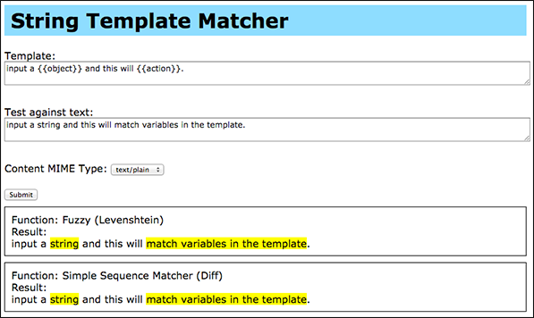

Text Template Matcher
=====================

Currently only tested on Python 2.7.x

Matchers: Difflib Matcher
-------------------------
Simple matcher using Python's [difflib SequenceMatcher](https://docs.python.org/2/library/difflib.html#).

```python
>>> from texttemplatematcher import difflibmatcher
>>> text     = "input a string and this will match variables in the template."
>>> template = "input a {{object}} and this will {{action}}."
>>> result   = difflibmatcher.template_match(text, template)
>>> for var in result:
>>>     print("Found '{:}' : '{:}'".format(var.v_name, var.value))
Found 'object' : 'string'
Found 'action' : 'match variables in the template'
>>> print("Marked: {:}".format(difflibmatcher.mark(text, result)))
Marked: input a {{string}} and this will {{match variables in the template}}.
```


Matchers: Fuzzy Matcher
-----------------------
This matcher is ported from [https://github.com/nathanathan/fuzzyTemplateMatcher](https://github.com/nathanathan/fuzzyTemplateMatcher).

The main difference between this and difflib matcher is: difflib matcher checks for exact matching sequence string, where fuzzy matcher will match the template...uhm...fuzzily (Check the difference between the sample input shown in this code and difflib matcher's).

```python
>>> from texttemplatematcher import fuzzymatcher
>>> text     = "input a string and this will match variables in the template."
>>> template = "Enter a {{object}}, and it will {{action}}."
>>> result   = fuzzymatcher.template_match(text, template)
>>> for var in result.vars:
>>>     print("Found '{:}' : '{:}'".format(var.v_name, var.value))
Found 'object' : 'string'
Found 'action' : 'match variables in the template'
>>> print("Marked: {:}".format(fuzzymatcher.mark(text, result.vars)))
Marked: input a {{string}} and this will {{match variables in the template}}.
```

**Current limitation**

    Since fuzzy matcher was originally written using recursive metdhod, and due to the constrain of Python's recursive depth,
    current implementation of fuzzy matcher can only process short amount of text.

Quick Demo
----------

Run quick demo script:

```bash
$ chmod +x quickdemo.sh
$ ./quickdemo.sh
```

A browser would be opened and the demo page should load:




Project Folders
---------------
- [texttemplatematcher](texttemplatematcher) : The source files for this project module
- [webapp](webapp) : Demo website written in [Flask](http://flask.pocoo.org/)

TODOs
-----
- text segmentation (nltk)
- charsets (i.e. different text segmentation method given a charset & MIME type)
- handling of MIME type: text/html
- Use: Hidden Markov Model
- Use: Conditional Random Field
- setup.py or pip install
